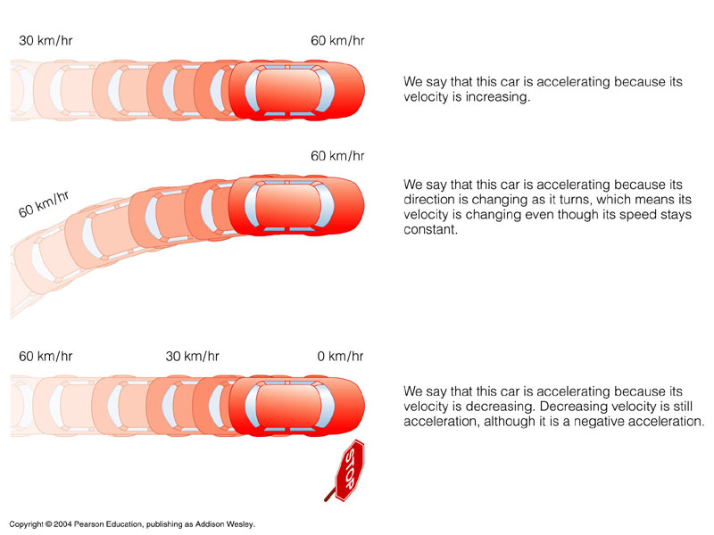
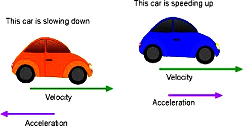
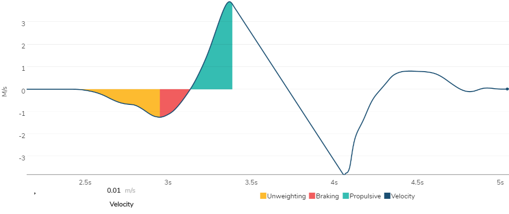

```{r libraries, echo=FALSE, warning=FALSE, message=FALSE}
library(tidyverse)
library(vembedr)

set.seed(123)
x = seq(0,1,.01) # plotting x and x would make velocity and acceleration the same
y = dnorm(x,.4,.1) # plotting x and y would make higher acceleration curve
y_2 = qnorm(x) # average this with Y to get bad acceleration
data = data.frame(x=x, y=(y+y_2),y_2=(y+y_2)/1.5)
```
## What Are We Looking At?
The video below syncs up the movements of the jump, with the force and velocity curves.  The velocity curve is the bottom graph, and the force curve is the top graph. The velocity curve starts at zero, which means the athlete is not moving.  As the hips descent, the velocity curve drops.  This is reflecting a negative velocity.  Then as the athlete begins to propel upwwards, you see the velocity curve increase.  As the athlete continues to cover more distance the velocity curve will increase.  The RATE that the velocity curve increases is known as **Acceleration**. <br>

<br>

<iframe src="https://player.vimeo.com/video/403772499?autoplay=1&loop=1&autopause=0" width="800" height="660" frameborder="0" allow="autoplay; fullscreen" allowfullscreen></iframe>

<br>

The force curve looks slightly different.  The force curve starts at the athlete's body weight.  Force is mass x acceleration. So if the athlete is not moving then the force is simply the athlete's bodyweight.  As the athlete begins to drop, the force curve drops as well.  This is indicative of the athlete "falling" or "unloading" where for a split second he isn't producing any force (so the curve descends toward zero).  Then as the curve begins to increase, that is the athlete beginning to produce force into the ground to decelerate himself.  This is known as the eccentric phase.  The force curve will continue to climb, but will look different for each athlete.  Once the athlete begins to move upward in the jump, that is the concentric phase. Where the curves peak and how many peaks there are (either 1 or 2) give us an idea of their force capabilities.  <br>
- 2 Peaks with the first being larger means they are stronger eccentrically <br>
- 2 Peaks with the second being larger means they are stronger concentrically <br>
- 1 Peak means they are generally "smoother" and accelerate well <br>

<br>


## Velocity vs. Acceleration
The fundamental principle to understand is the difference between Velocity & Acceleration.
- Velocity = Change In Distance / Change In Time
- Acceleration = Change In Velocity

<br>



<br>

Another good, and more simple example of the difference between velocity and acceleration is the image below

<br>



<br>

This image is the perfect example of how you can still be increasing velocity, but losing acceleration by increasing at a slower rate.  What does this look like?  Let's say the red car is moving at a speed of 60pmh and it slows down to 50mph.  It is still gaining ground and momentum, but it is doing it at a slower rate.  This means velocity is increasing still while acceleration is decreasing.  On the flip side, let's say the blue car is moving at a speed of 60mph and it speeds up to 70mph.  Now velocity and Acceleration are both increasing.  

<br>
**************
<br>

## Application to Force Plates
The concepts behind acceleration and velocity are the basis behind athlete evaluation.  We have picked 3 metrics: <br>

<br>

- Takeoff Velocity <br>
- Average Concentric Velocity <br>
- Average Concentric Relative Force (Acceleration) <br>
*Force equals mass x acceleration. Which means when we look at relative force (Force/Mass), we are essentially isolating acceleration.

<br>


<br>

The yellow portion (Unweighting Phase) is the process of the athlete letting his hips fall and beginning his descent. <br>
The red portion (Braking Phase) is the athlete beginning to put force in the ground to slow himslef down <br>
The green portion (Porpulsive Phase) is the concentric portion of the jump and it is the athlete accelerating upwards in the jump <br>
<br>
We will only be focused on the concentric portion of the jump.  The following graphs will only have the left side of the velocity curve, starting at 0 (0 velocity is the bottom of the jump where the athlete begins moving up).

### Example Graphs

```{r graph 1, echo=FALSE, warning=FALSE}
data %>%
  ggplot() +
  geom_line(aes(x=x,y=(x*9)-1.4), color = 'dark red', size = 2) +
  scale_x_continuous(name = "Time", breaks = seq(0,1,.1), limits = c(-.1,.6)) +
  scale_y_continuous(name = "Velocity", limits = c(-1.4,3)) +
  ggtitle("Acceleration = Velocity") +
  theme(panel.grid.major = element_line(colour = "#d3d3d3"),
        panel.grid.minor = element_blank(),
        panel.border = element_blank(), panel.background = element_blank(),
        axis.title.x = element_text(size = 14, face = "bold.italic"),
        axis.text = element_blank(),
        axis.title.y = element_text(size = 14, face = "bold.italic"),
        axis.line = element_line(size=1, colour = "black"),
        text=element_text(family="Tahoma"),
        plot.title = element_text(size = 18, family = "Tahoma", face = "bold", hjust = .5),
        legend.position = "bottom")
```

<br>

This graph is an example of velocity and acceleration being equally as good.  Velocity is both high, and increasing at a consistet rate.  An athlete with a curve like this would be perfectly even.

<br>

```{r graph 2, echo=FALSE, warning=FALSE}

data[1:45,] %>%
  ggplot() +
  geom_line(aes(x=x,y=y_2), color = 'black', size = 2) +
  geom_line(aes(x=x,y=lag(x,3)*10-1.6), color = 'dark red', size = 1.5, linetype = 'dashed', alpha = .4) +
  scale_x_continuous(name = "Time", limits = c(-.1,.6)) +
  scale_y_continuous(name = "Velocity", limits = c(-1.4,3)) +
  ggtitle("Acceleration < Velocity") +
  theme(panel.grid.major = element_line(colour = "#d3d3d3"),
        panel.grid.minor = element_blank(),
        panel.border = element_blank(), panel.background = element_blank(),
        axis.title.x = element_text(size = 14, face = "bold.italic"),
        axis.text = element_blank(),
        axis.title.y = element_text(size = 14, face = "bold.italic"),
        axis.line = element_line(size=1, colour = "black"),
        text=element_text(family="Tahoma"),
        plot.title = element_text(size = 18, face = "bold", hjust = .5),
        legend.position = "bottom")

```
<br>
In this graph, the red dotted line is still an example of velcoity and acceleration being even.  The black line is what the graph looks like for an athlete whose acceleration is worse than his velocity.  This is evident by the curve starting out strong and straight (even with the dotted line), then curving underneath the dotted line.  Notice here the velocity is still increasing, but acceleration has descreased (think back to the car example).  Eventually the graph comes back above the red dotted line in order to produce a high take off velocity.

<br>

```{r graph 3, echo=FALSE, warning=FALSE}

data[1:45,] %>%
  ggplot() +
  geom_line(aes(x=x,y=y), color = 'black', size = 2) +
  geom_line(aes(x=x,y=(x*12)-1), color = 'dark red', size = 1.5, linetype = 'dashed', alpha = .4) +
  scale_x_continuous(name = "Time", limits = c(-.1,.6)) +
  scale_y_continuous(name = "Velocity", limits = c(-1,4)) +
  ggtitle("Acceleration > Velocity") +
  theme(panel.grid.major = element_line(colour = "#d3d3d3"),
        panel.grid.minor = element_blank(),
        panel.border = element_blank(), panel.background = element_blank(),
        axis.title.x = element_text(size = 14, face = "bold.italic"),
        axis.text = element_blank(),
        axis.title.y = element_text(size = 14, face = "bold.italic"),
        axis.line = element_line(size=1, colour = "black"),
        text=element_text(family="Tahoma"),
        plot.title = element_text(size = 18, face = "bold", hjust = .5),
        legend.position = "bottom")

```
<br>

This third and final graph represents what a curve would look like for an athlete who has better acceleration than velocity. You can see the black line starts out with a little bit of an arc, and shoots up very quickly as it gathers momentum.  This is the sign of an athlete who can accelerate throughout the entire jump.  

<br>


## Application To Baseball Performance
The physics behind these concepts are not only the basis of our force plate analysis, but of our sport in general.  In order to produce the highest exit velocity possible, two things have to happen.  First, you need to hit the ball on the barrel (skill).  Second, the bat needs to have gathered as much momentum as possible at impact (skill & physics).  Momentum is simple, (mass x velocity). In the form of a vertical jump test, it is your body mass X takeoff velocity (reference above graphs).  In the form of a baseball swing, it is the mass of the bat x the the velocity at impact. This is where we reference our blast graphs and why peak hand speed is so important. The faster your hands are moving, the higher the momentum at impact (assuming weight of the bat is the same).     

<br>

The graph below allows you see how mass and velocity affects momentum

<br>

*INSERT INTERACTIVE PLOT*
